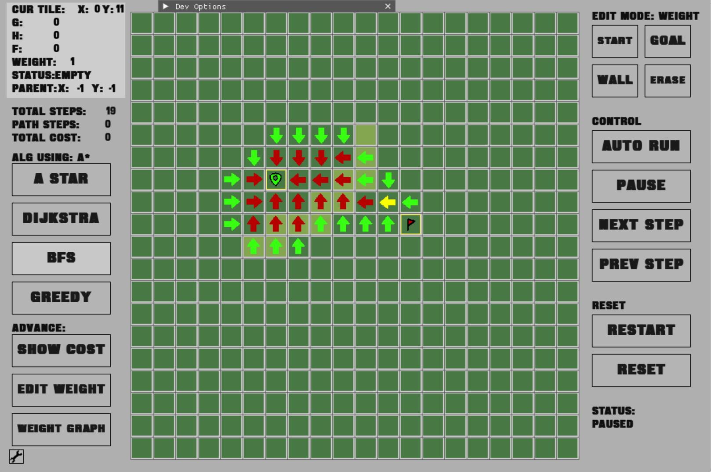
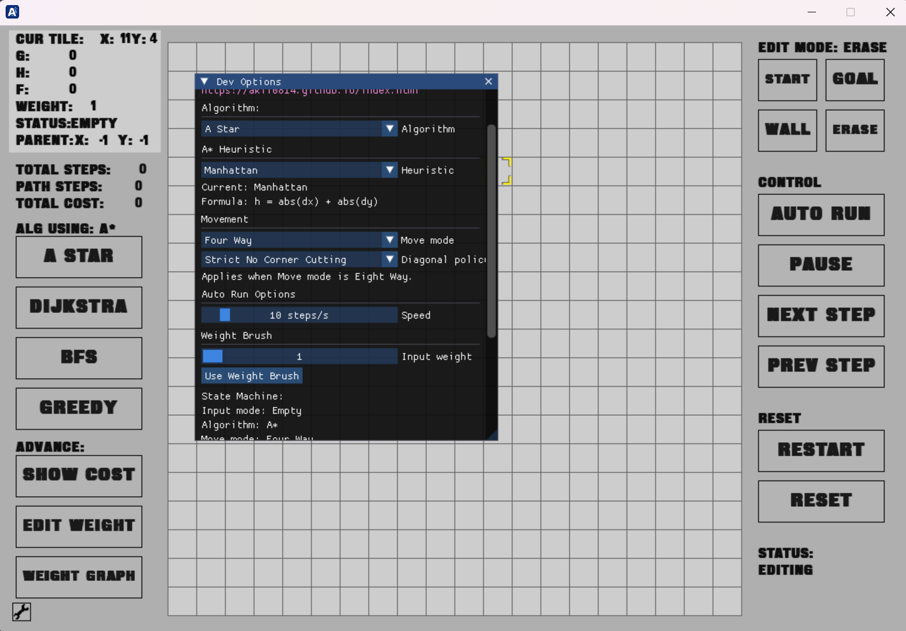
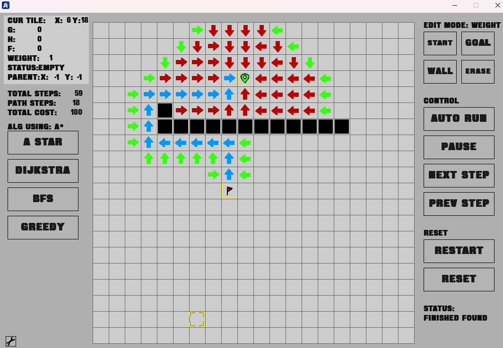
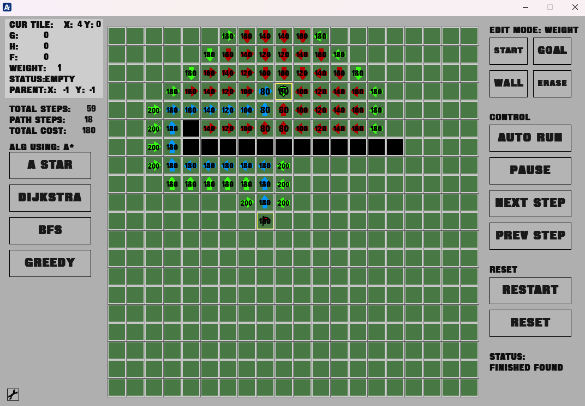
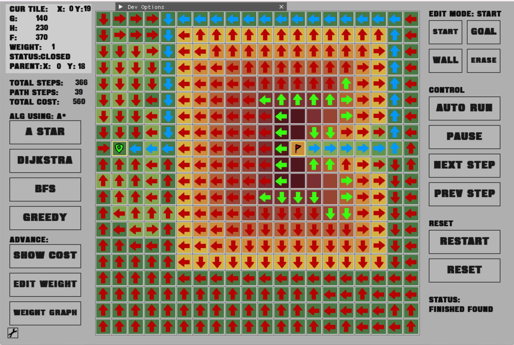

# PathFindingVisualizer / 寻路算法可视化

[English README](README-EN.md) | [中文详细说明](README-CN.md)

`PathFindingVisualizer` is a C++17 desktop path-finding visualizer built with SDL2 and Dear ImGui. It supports interactive grid editing, step-by-step execution, auto-run, rollback, and developer-oriented debugging tools.

`PathFindingVisualizer` 是一个基于 C++17、SDL2 和 Dear ImGui 构建的桌面寻路算法可视化项目，支持网格交互编辑、逐步执行、自动运行、状态回退与调试观察。

## Screenshots / 运行截图

### Main View / 主界面

### GUI Panel / 控制面板

### Path Result / 路径结果

### Cost Visualization / 代价显示

### Weight Visualization / 权重显示

## Features / 功能特性

- Edit start node, goal node, walls, and weighted tiles / 支持编辑起点、终点、墙体和权重格
- Adjustable grid weights / 支持自定义网格权重
- 4-way and 8-way movement modes / 支持四向与八向移动模式
- Step-by-step execution and rollback / 支持单步执行与回退
- Auto-run, pause, and reset / 支持自动运行、暂停与重置
- Multiple algorithms / 支持多种算法
- Multiple heuristic modes / 支持多种启发函数模式
- Custom algorithm interface/ 提供自定义算法接口

## Release / 发布说明

 Prebuilt executables for Windows x64 are available in Releases
 
 Releases 提供可直接运行的 Windows x64 可执行文件

## More Details / 更多说明

 For architecture notes, implementation details, and design decisions, see [README-EN.md](README-EN.md). / 更多架构说明、实现细节与设计说明见 [README-CN.md](README-CN.md)。
