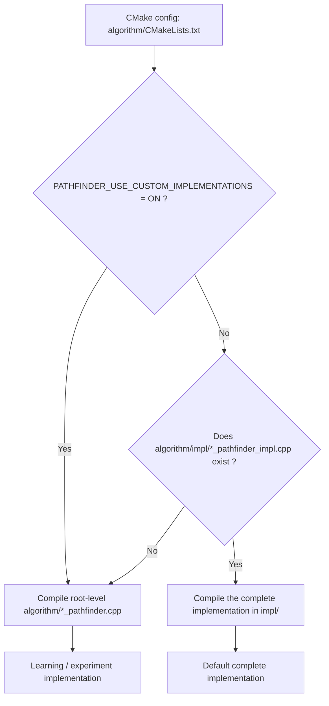

# Pathfinding Implementation Guide

This directory contains the `Pathfinder` base class, empty algorithm skeletons for learning and experimentation, and the default algorithm implementations provided by the project.

The goal of this project structure is to let algorithm learners focus only on the search logic itself, without having to deal with SDL rendering, button events, playback speed, pause, reset, or rollback logic.

To keep step-by-step execution, auto-run, rollback, and visualization state consistent, the following states must be maintained correctly by each algorithm implementation.

## Source File Selection

`algorithm/CMakeLists.txt` selects which algorithm source files to compile during CMake configuration.

- Default mode: `PATHFINDER_USE_CUSTOM_IMPLEMENTATIONS=OFF`
  - If `algorithm/impl/*_pathfinder_impl.cpp` exists, the complete implementation in `impl/` is compiled.
  - If an algorithm does not have an impl file, it falls back to `algorithm/*_pathfinder.cpp` in the root algorithm directory.
  - `CustomPathfinder` has no impl file, so it always falls back to the root directory version.
- Learning / experiment mode: `PATHFINDER_USE_CUSTOM_IMPLEMENTATIONS=ON`
  - Compiles `algorithm/*_pathfinder.cpp` from the root algorithm directory.
  - These files only keep empty implementation skeletons for learning and experimentation.



Example:

```powershell
cmake -S . -B build -DPATHFINDER_USE_CUSTOM_IMPLEMENTATIONS=OFF
cmake --build build --config Debug
```

You can also change the default value of this option in `algorithm/CMakeLists.txt` to `ON`, so that new CMake configurations use the learning / experiment implementations in the root directory by default.

Note: CMake caches previous option values. If the `build/` directory has already been configured, it is recommended to pass `-DPATHFINDER_USE_CUSTOM_IMPLEMENTATIONS=ON` explicitly, or clear the old build directory and reconfigure.

## File Responsibilities

- `path_finder.h` / `path_finder.cpp`: shared base class and helpers used by all algorithms.
- `a_star_pathfinder.h`, `bfs_pathfinder.h`, `dijkstra_pathfinder.h`, `greedy_pathfinder.h`: algorithm state and class declarations.
- `custom_pathfinder.h` / `custom_pathfinder.cpp`: an empty skeleton intended for custom algorithms.
- `*_pathfinder.cpp`: learning-mode skeletons, compiled when `PATHFINDER_USE_CUSTOM_IMPLEMENTATIONS=ON`.
- `impl/*_pathfinder_impl.cpp`: default complete implementations, compiled when `PATHFINDER_USE_CUSTOM_IMPLEMENTATIONS=OFF`.

## Default Implemented Algorithms

- A*: the priority queue is ordered by `f = g + h`, and the heuristic can be selected in the Dev panel.
- Dijkstra: the priority queue is ordered by the currently known minimum `g` cost.
- BFS: progresses with a FIFO queue; it finds the path with the fewest movement steps, but not necessarily the lowest total weighted cost.
- Greedy Best-First Search: the priority queue is ordered by heuristic distance; it is useful for observing search direction, but does not guarantee an optimal path.

## Algorithm Class Interface Contract

Each algorithm class should inherit from `CloneablePathfinder<YourPathfinder>`:

```cpp
class YourPathfinder final : public CloneablePathfinder<YourPathfinder>
{
public:
    void next_step() override;
};
```

The job of `next_step()` is to advance the visualization by one search step, not to run the entire algorithm in a single call. This is what allows `SimulationController` to support `Next Step`, `Auto Run`, `Pause`, and `Prev Step`.

`CloneablePathfinder` automatically copies the internal state of the algorithm. Before each step, `SimulationController` stores an algorithm copy and a board snapshot so that the previous step can be restored.

## Shared Pathfinder Helpers

Prefer using these base-class helpers instead of rewriting board logic inside every algorithm:

```cpp
bool read_endpoints(Point& start, Point& goal) const;
std::vector<Point> neighbors(Point point) const;
bool same_point(Point lhs, Point rhs) const;
bool is_start_or_goal(Point point) const;
int tile_weight(Point point) const;
int movement_cost(Point from, Point to) const;
int heuristic_cost(Point from, Point to, HeuristicMode mode) const;

void clear_tile_path_data(Point point);
void set_tile_parent(Point child, Point parent);
void set_tile_costs(Point point, int g_cost, int h_cost);
void mark_tile_current(Point point);
void mark_tile_open(Point point);
void mark_tile_closed(Point point);
void mark_tile_path(Point point);
void close_current_tile(Point& current);
bool rebuild_path(Point start, Point goal);
```

These helpers handle board boundaries, start/goal protection, diagonal movement policy, tile weights, visualization state maintenance, and final path reconstruction in a unified way.

## States That Must Stay in Sync

### 1. Algorithm finished state

Do not let the algorithm continue modifying the board after it has finished. At the beginning of `next_step()`, you usually need:

```cpp
if (is_finished())
    return;
```

When a path is found, call:

```cpp
mark_finished(rebuild_path(_start, _goal));
```

When the frontier / open set is exhausted and no path is found, call:

```cpp
mark_finished(false);
```

`SimulationController` uses this state to stop auto-run, update the final path total cost and path step count, and display the finished state in the UI.

### 2. Start and goal

During initialization, use the shared helper to read and validate the endpoints:

```cpp
if (!read_endpoints(_start, _goal))
{
    mark_finished(false);
    return;
}
```

Although the UI tries to prevent running without a start or goal, the algorithm itself should still perform defensive checks.

### 3. frontier / open set / visited / best-cost state

These are internal states of the algorithm itself and should not be stored in `Board`.

Common mappings:

- BFS: `std::queue<Point>` as the frontier, together with `visited[y][x]`.
- Dijkstra: priority queue ordered by minimum `g_cost`, together with `best_cost[y][x]`.
- A*: priority queue ordered by minimum `f_cost = g_cost + h_cost`, together with `best_cost[y][x]`.
- Greedy: priority queue ordered by minimum `h_cost`, together with `visited[y][x]`.

These containers must be member variables of the algorithm class so that automatic cloning can preserve the full search state.

### 4. `Tile::Status` visualization state

The board uses `Tile::Status` to determine how each tile is displayed. Algorithm implementations must maintain these states carefully:

- `Start`: the start tile; do not overwrite it as `Open`, `Closed`, `Current`, or `Path`.
- `Goal`: the goal tile; do not overwrite it as `Open`, `Closed`, `Current`, or `Path`.
- `Wall`: an obstacle; do not add it to the frontier and do not rewrite its state.
- `Open`: discovered but waiting to be processed.
- `Current`: the tile currently being expanded in this step.
- `Closed`: already fully processed.
- `Path`: a tile on the final path, usually excluding the start and goal.
- `Empty`: a normal walkable tile.

Recommended flow:

1. At the beginning of each step, call `close_current_tile(_current)`.
2. Pop a new current tile from the frontier / open set.
3. If the current tile is not the start or goal, call `mark_tile_current(current)`.
4. Traverse the neighbors, and mark newly discovered or better-updated tiles with `mark_tile_open(next)`.
5. When the goal is found, call `mark_finished(rebuild_path(_start, _goal))`.

### 5. Parent backtracking pointer

When a neighbor should be reached through the current node, call:

```cpp
set_tile_parent(next, current);
```

Final path reconstruction depends on the parent chain. Directional textures also use the parent chain to point toward each tile's parent.

During start-node initialization, you should usually clear its path data:

```cpp
clear_tile_path_data(_start);
```

### 6. G / H / F costs

`Tile` has three public cost fields:

```cpp
int _g_cost = 0;
int _h_cost = 0;
int _f_cost = 0;
```

Recommended meanings:

- `_g_cost`: the known cost from the start to the current tile.
- `_h_cost`: the heuristic estimate from the current tile to the goal.
- `_f_cost`: the total cost used for display or ordering, usually `g + h`.

Use the shared setter:

```cpp
set_tile_costs(next, next_g_cost, next_h_cost);
```

The algorithm should use the base-class helper to calculate movement cost consistently:

```cpp
const int next_g_cost = current_tile._g_cost + movement_cost(current, next);
```

The actual movement cost is controlled by `MovementCostConfig` in `Board`, and `Pathfinder::movement_cost(...)` delegates to `Board::movement_cost(...)`:

```cpp
struct MovementCostConfig
{
    int straight = 10;
    int diagonal = 14;
};
```

Current default cost rules:

- Straight move: `10 * tile_weight(destination)`.
- Diagonal move: `14 * tile_weight(destination)`.

Different algorithms can use these values as follows:

- BFS: record `g`, use `h = 0`, `f = g`, but still advance the queue by movement step count.
- Dijkstra: record `g`, use `h = 0`, `f = g`, and pop the minimum `g`.
- A*: record `g`, `h`, and `f = g + h`, and pop the minimum `f`.
- Greedy: record `g` for display and path cost, but pop the minimum `h`.

### 7. 4-direction / 8-direction movement and diagonal policies

Do not hardcode neighbor directions inside each algorithm. Use:

```cpp
for (const Point next : neighbors(current))
{
    // ...
}
```

`Pathfinder::neighbors(...)` forwards to `Board::neighbors(point, move_mode(), diagonal_policy())`.

`Board::neighbors(...)` filters out-of-bounds tiles, walls, and diagonal moves according to the current `DiagonalMovePolicy`:

- `BlockIfEitherSideBlocked`: strictly prevents corner cutting.
- `BlockIfBothSidesBlocked`: more loosely prevents corner cutting.
- `IgnoreSideBlocks`: ignores side walls and allows diagonal passage.

The algorithm still needs to handle its own visited, closed, or better-path checks.

### 8. Heuristics

`Pathfinder::heuristic_cost(...)` uses the currently configured movement cost scale:

- Manhattan: `straight * (dx + dy)`.
- Euclidean: `round(straight * sqrt(dx*dx + dy*dy))`.
- Octile: `diagonal * min(dx, dy) + straight * (max(dx, dy) - min(dx, dy))`.
- Chebyshev: `straight * max(dx, dy)`.

This is the standard Octile form, using the current `diagonal` value directly. For 8-direction A*, Octile usually matches the default 10/14 movement model best.

If you set movement costs to unusual combinations, for example making diagonal movement cheaper than straight movement, the usual geometric heuristics may no longer satisfy the optimality assumptions of A*. That kind of configuration is fine for experimentation, but results under that setup should not be treated as strictly optimal paths.

### 9. State required for previous-step rollback

`Prev Step` depends on two snapshots:

- `Board::save_snapshot()` saves the board tile state.
- `CloneablePathfinder` saves the internal algorithm state through automatic `clone()`.

Therefore, any data that affects search progress must be stored in algorithm member variables and must be copyable, for example:

- Whether initialization has already happened.
- frontier / open set.
- visited or best-cost arrays.
- current node.
- start and goal.
- algorithm-specific priority queues or tie-breaker data.

Do not put critical state in local static variables inside `next_step()`, and do not depend on external objects that cannot be copied.

### 10. What algorithms should not handle

Algorithm implementations should not be responsible for the following:

- Do not process SDL events.
- Do not render directly.
- Do not manage buttons, windows, or ImGui.
- Do not call `Board::save_snapshot()`.
- Do not lock or unlock board editing.
- Do not control auto-play speed.
- Do not reset the entire board.

These responsibilities belong to `Application`, `SimulationController`, and `Board`.

## Recommended Implementation Steps

1. Add member variables to the algorithm class, such as `_initialized`, `_frontier` or `_open_set`, `_visited` or `_best_cost`, `_start`, `_goal`, and `_current`.
2. On the first entry into `next_step()`, initialize the start, goal, frontier / open set, and costs.
3. At the beginning of each step, call `close_current_tile(_current)`.
4. If the frontier / open set is empty, call `mark_finished(false)`.
5. Pop the current node and update its visualization state.
6. Traverse `neighbors(current)`.
7. Update neighbor parent, cost, state, and search containers according to the algorithm rule.
8. When the goal is found, call `mark_finished(rebuild_path(_start, _goal))`.
9. Make sure automatic cloning preserves all search state, then test `Prev Step`.

## Common Pitfalls

- Overwriting `Start` or `Goal`, causing them to be displayed as normal search states.
- Updating only the priority queue without also updating tile parent and `g / h / f`, causing path reconstruction or cost display errors.
- Forgetting to call `mark_finished(...)` after reaching the goal, so auto-run does not stop correctly.
- Forgetting to call `mark_finished(false)` when the frontier becomes empty, leaving the search stuck in a running state.
- Storing internal state outside member variables, causing algorithm state and board state to go out of sync after `Prev Step`.
